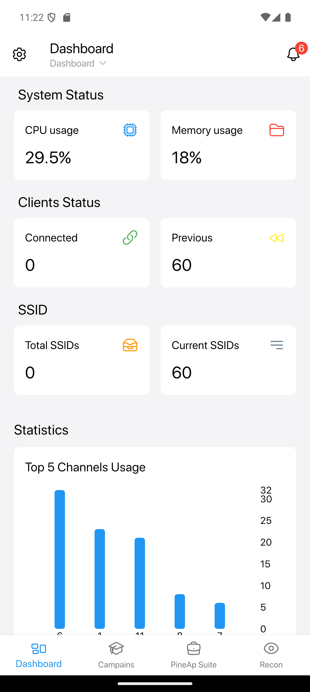
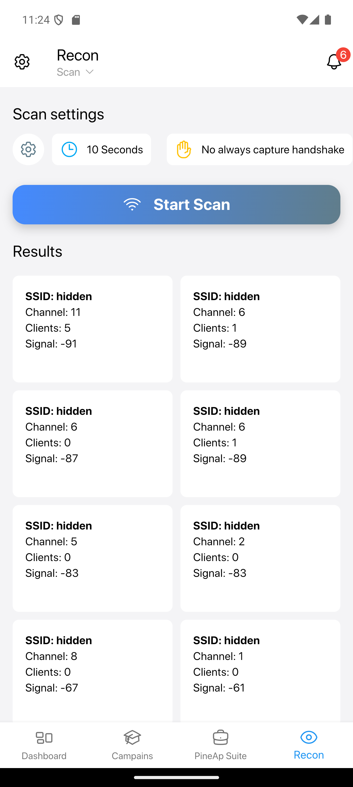

  

# PineApp - Unofficial Mobile Controller for WiFi Pineapple

  
  &nbsp;&nbsp;&nbsp;&nbsp;
  

**PineApp** is an **unofficial mobile application** designed to seamlessly control your WiFi Pineapple device from the convenience of your smartphone. Built using **Flutter**, PineApp offers a sleek and responsive interface that brings the power of the Pineapple right to your pocket.

## 🚀 Features

- **Dashboard**: A comprehensive dashboard that provides an at-a-glance overview of your Pineapple device, including key metrics and status updates.
  
- **Recon**: Full control over the reconnaissance capabilities of your Pineapple, allowing you to scan, identify, and analyze WiFi networks around you in real-time.

## 🛠️ Work In Progress

PineApp is still in **active development**. While the dashboard and recon features are fully functional, several exciting features are on the roadmap, including:

- **Campaigns**: Upcoming support for managing Pineapple campaigns, allowing you to launch and monitor long-term operations.
  
- **PineAp Suite**: Integration of the full PineAp suite, which will enable advanced attack and network manipulation features directly from the app.

## 📱 Technology

PineApp is developed in **Flutter**, ensuring cross-platform compatibility, a smooth user experience, and rapid development. As a mobile-first solution, PineApp is designed to make controlling your WiFi Pineapple more accessible than ever, right from your phone.

## ⚠️ Disclaimer

PineApp is an **unofficial** project and is not affiliated with **Hak5**. It is being developed as a personal project and is not intended for commercial purposes. Use responsibly and in accordance with all applicable laws and regulations.

---

Stay tuned for more updates as PineApp evolves!
